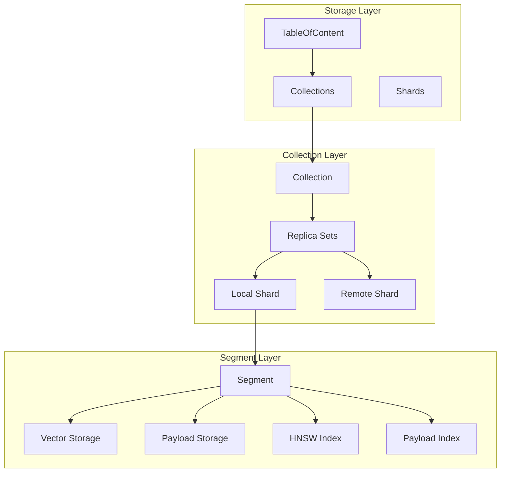
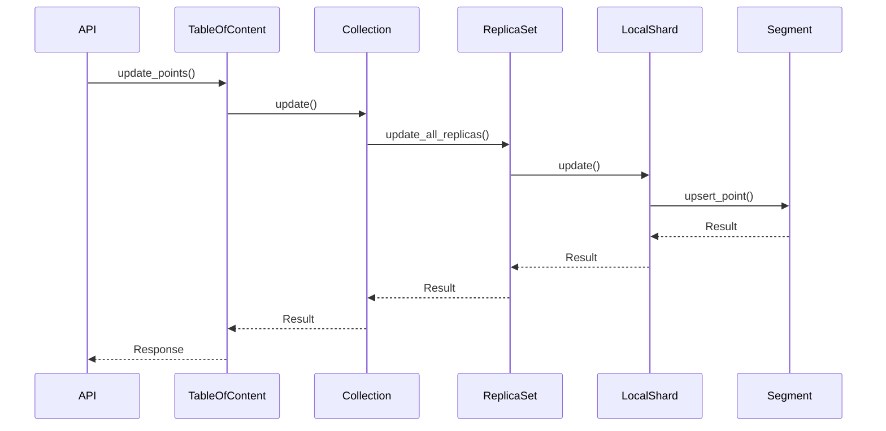
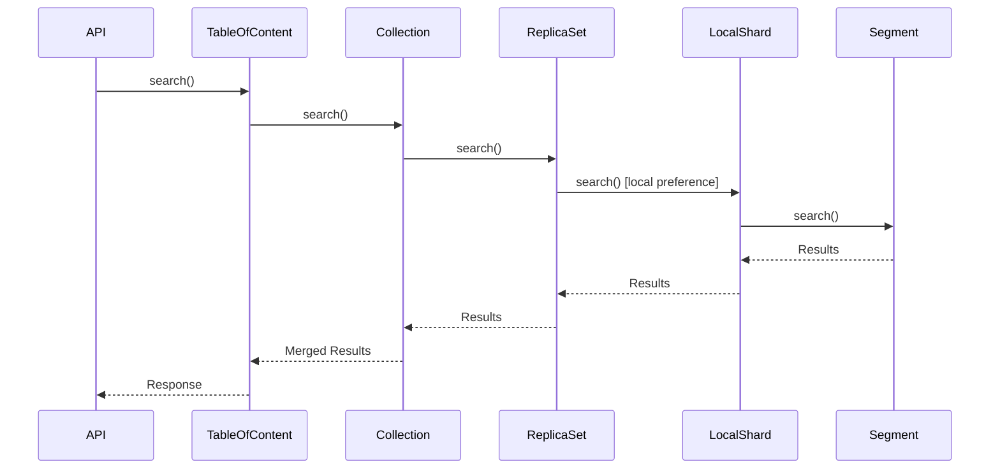

Qdrant is a high-performance vector database built with a modular, layered architecture designed for scalability, reliability, and efficiency. This document provides an overview of Qdrant's core architectural components.

## System Architecture

Qdrant's architecture is organized into three primary layers:



## Core Components

### Storage Layer

The storage layer (`lib/storage/`) manages the entire service lifecycle and provides the top-level abstraction for all operations.

**TableOfContent** (`lib/storage/src/content_manager/toc/mod.rs:67`)

The main object of the service that holds all required components:

- **Collections Management**: Maintains a `HashMap` of all collections with concurrent access via `RwLock`
- **Runtime Management**: Provides separate runtimes for search, updates, and general operations
- **Resource Management**: Global CPU budget (`ResourceBudget`) for optimization tasks
- **Consensus Integration**: Optional connection to Raft consensus for distributed mode
- **Rate Limiting**: Prevents DDoS in distributed deployments

```rust
pub struct TableOfContent {
    collections: Arc<RwLock<Collections>>,
    storage_config: Arc<StorageConfig>,
    search_runtime: Runtime,
    update_runtime: Runtime,
    general_runtime: Runtime,
    optimizer_resource_budget: ResourceBudget,
    consensus_proposal_sender: Option<OperationSender>,
    // ...
}
```

### Collection Layer

The collection layer (`lib/collection/`) implements data partitioning through sharding and replication.

**Collection** (`lib/collection/src/collection/mod.rs:66`)

A collection splits data across multiple shards for horizontal scalability:

- **Shard Distribution**: Data is partitioned using configurable sharding methods
- **Replication**: Each shard can have multiple replicas across peers
- **Transfer Management**: Handles shard migration between nodes
- **Configuration**: Stores vector, distance, and optimization settings

**ShardReplicaSet** (`lib/collection/src/shards/replica_set/mod.rs:95`)

Manages consistency across shard replicas:

- **Local and Remote Replicas**: Maintains both local shards and remote shard connections
- **State Management**: Tracks replica states (Initializing, Active, Listener, Dead, Partial)
- **Read Preference**: Routes reads to local shards when available
- **Write Coordination**: Ensures updates are applied to all replicas

**Shard Types** (`lib/collection/src/shards/shard.rs:51`)

```rust
pub enum Shard {
    Local(LocalShard),       // Full data storage on this node
    Proxy(ProxyShard),       // Forwards to remote shard
    ForwardProxy(ForwardProxyShard),
    QueueProxy(QueueProxyShard),
    Dummy(DummyShard),       // Placeholder during initialization
}
```

### Segment Layer

The segment layer (`lib/segment/`) is the fundamental storage and indexing unit.

**Segment** (`lib/segment/src/segment/mod.rs:66`)

An independent group of points with its own storage and indexes:

- **ID Tracking**: Maps external IDs to internal offsets
- **Vector Data**: Multiple named vector storages with optional quantization
- **Payload Storage**: Stores point metadata and attributes
- **Indexes**: HNSW for vectors, field indexes for payloads
- **Versioning**: Tracks point versions and update sequences
- **Persistence**: Manages flushing and snapshotting

```rust
pub struct Segment {
    pub uuid: Uuid,
    pub version: Option<SeqNumberType>,
    pub id_tracker: Arc<AtomicRefCell<IdTrackerSS>>,
    pub vector_data: HashMap<VectorNameBuf, VectorData>,
    pub payload_index: Arc<AtomicRefCell<StructPayloadIndex>>,
    pub payload_storage: Arc<AtomicRefCell<PayloadStorageEnum>>,
    pub segment_type: SegmentType,
    // ...
}
```

## Data Flow

### Write Path



1. **Request Reception**: API receives update request
2. **Collection Routing**: TableOfContent routes to appropriate collection
3. **Shard Selection**: Collection determines target shard(s) based on sharding key
4. **Replica Coordination**: ReplicaSet forwards to all replicas
5. **Local Update**: LocalShard applies to underlying segments
6. **Index Update**: Segment updates vector storage and indexes

### Read Path



1. **Query Reception**: API receives search request
2. **Collection Access**: TableOfContent accesses collection
3. **Shard Query**: Query is sent to relevant shards
4. **Local Preference**: ReplicaSet prefers local shard for reads
5. **Segment Search**: LocalShard queries all segments
6. **Result Merging**: Results are merged and ranked

## Runtime Separation

Qdrant uses dedicated Tokio runtimes for workload isolation:

- **Search Runtime**: Handles read-heavy search operations
- **Update Runtime**: Processes write operations and WAL
- **General Runtime**: Manages background tasks, optimization, transfers

This separation prevents search queries from being blocked by heavy updates and vice versa.

## Concurrency Model

Qdrant employs a fine-grained locking strategy:

- **Arc + AtomicRefCell**: Interior mutability for low-contention components
- **RwLock**: Read-biased locks for collections and configurations
- **Mutex**: Exclusive access for critical sections (WAL, state changes)
- **Lock-free structures**: Atomic operations where possible

## Design Principles

1. **Layered Architecture**: Clear separation between storage, collection, and segment layers
2. **Horizontal Scalability**: Sharding and replication for distributed deployments
3. **Local-first Reads**: Minimize network overhead by preferring local data
4. **Write Consistency**: All replicas must acknowledge updates
5. **Incremental Updates**: Background optimization without blocking operations
6. **Resource Management**: CPU budgets and rate limiting prevent resource exhaustion

## Next Steps

<CardGroup cols={2}>
  <Card title="Storage Engine" icon="database" href="/advanced/storage-engine">
    Deep dive into storage layer design and persistence
  </Card>
  <Card title="Vector Indexing" icon="vector-square" href="/advanced/vector-indexing">
    Learn about HNSW and index structures
  </Card>
  <Card title="Distributed Deployment" icon="server" href="/advanced/distributed-deployment">
    Understand cluster architecture and Raft consensus
  </Card>
  <Card title="API Reference" icon="code" href="/api/overview">
    Explore the complete API documentation
  </Card>
</CardGroup>