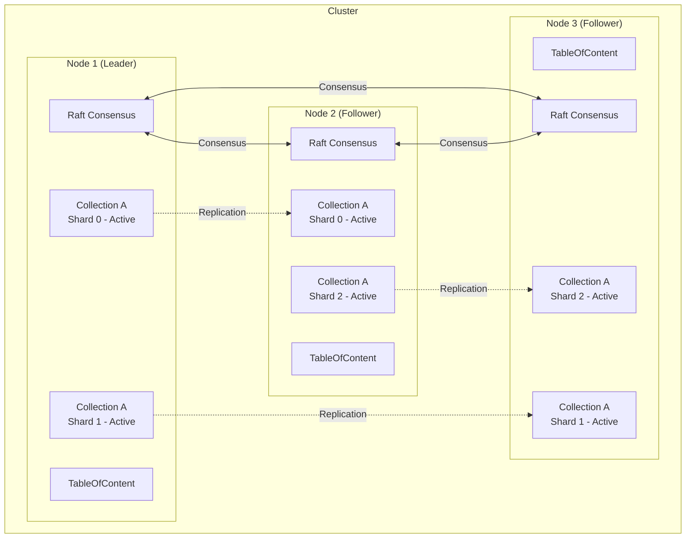
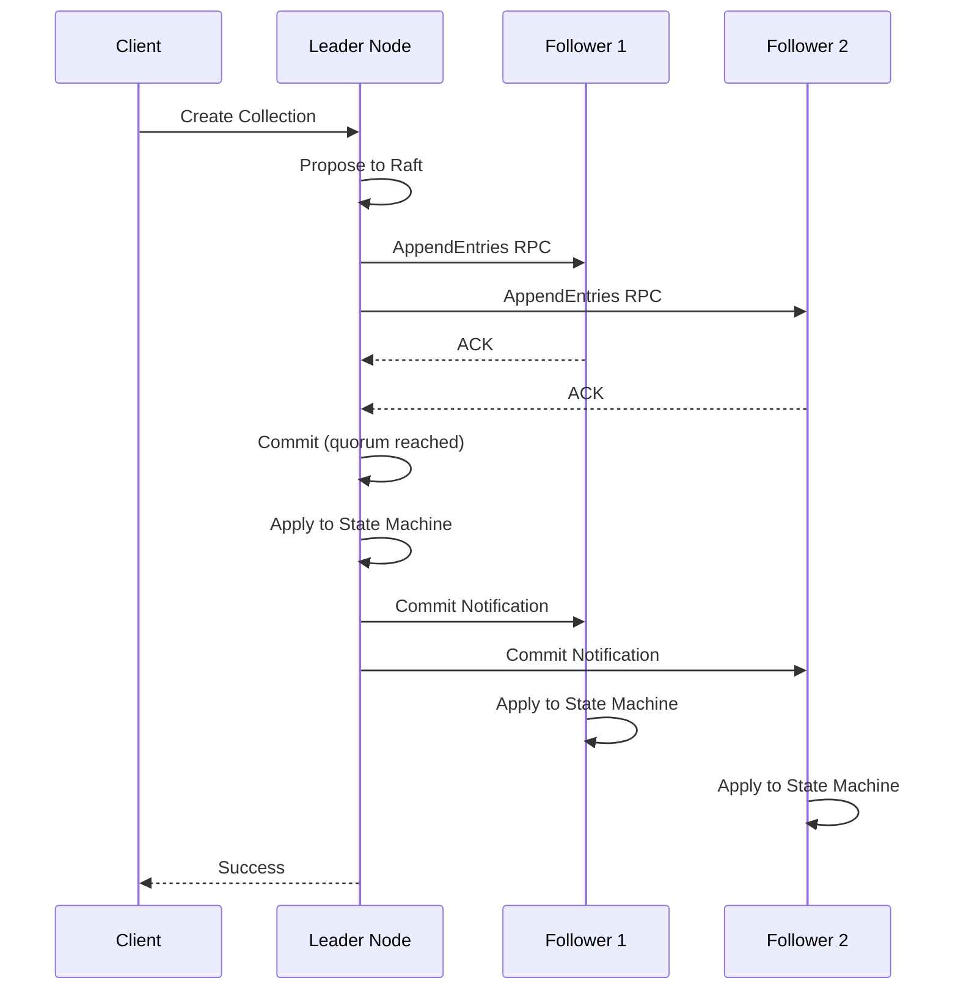
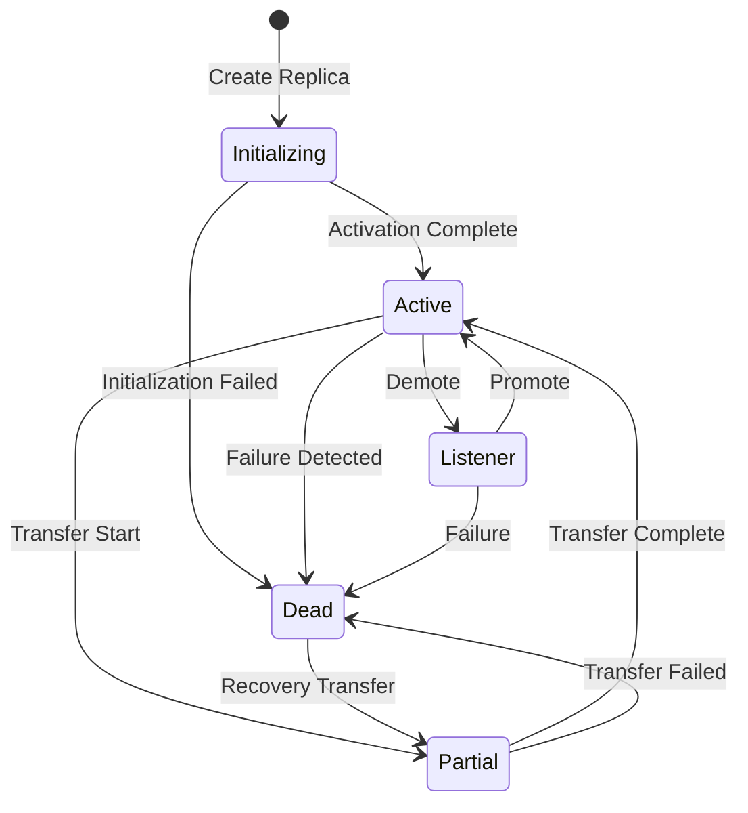
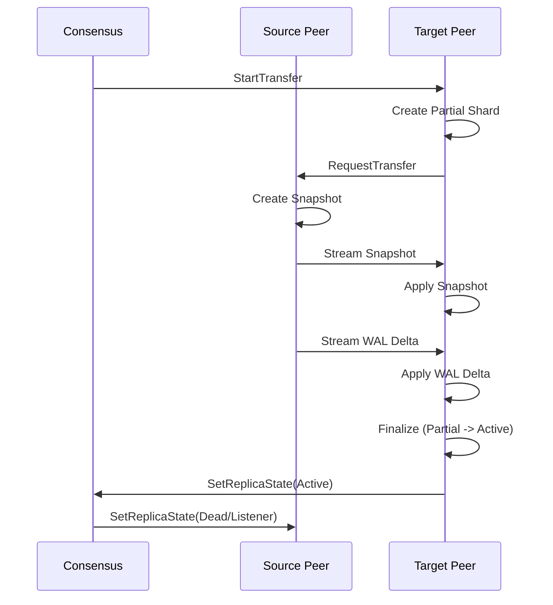

Qdrant supports distributed deployment for horizontal scalability and high availability. This document explains the cluster architecture, Raft consensus protocol, and distributed coordination mechanisms.

## Cluster Architecture

### Node Topology



### Key Concepts

**Peer:** A single Qdrant instance in the cluster

**Shard:** A partition of collection data

**Replica:** A copy of a shard on a specific peer

**Consensus:** Agreement protocol for cluster metadata and topology

## Raft Consensus

Qdrant uses the Raft consensus algorithm to maintain cluster state consistency.

### Consensus Manager

**ConsensusManager** (`lib/storage/src/content_manager/consensus_manager.rs:77`):

```rust
pub struct ConsensusManager<C: CollectionContainer> {
    pub persistent: RwLock<Persistent>,
    pub is_leader_established: Arc<IsReady>,
    wal: Mutex<ConsensusOpWal>,
    soft_state: RwLock<Option<SoftState>>,
    toc: Arc<C>,
    on_consensus_op_apply: Mutex<HashMap<ConsensusOperations, broadcast::Sender<Result<bool, StorageError>>>>,
    propose_sender: OperationSender,
    consensus_thread_status: RwLock<ConsensusThreadStatus>,
}
```

**Responsibilities:**

- **Leader Election**: Determines which peer coordinates cluster operations
- **Log Replication**: Ensures all peers agree on operation sequence
- **State Machine**: Applies consensus operations to cluster state
- **Snapshot Management**: Compacts consensus log for efficiency

### Persistent State

**Persistent** (`lib/storage/src/content_manager/consensus/persistent.rs:31`):

```rust
pub struct Persistent {
    pub state: RaftState,                    // Raft state (term, commit, vote)
    pub latest_snapshot_meta: SnapshotMetadata,
    pub apply_progress_queue: EntryApplyProgressQueue,
    pub peer_address_by_id: Arc<RwLock<PeerAddressById>>,
    pub peer_metadata_by_id: Arc<RwLock<PeerMetadataById>>,
    pub cluster_metadata: HashMap<String, serde_json::Value>,
    pub this_peer_id: PeerId,
}
```

**Persisted Components:**

- **Raft State**: Current term, commit index, voted-for
- **Peer Topology**: Addresses and metadata of all peers
- **Cluster Metadata**: Custom key-value data
- **Snapshot Metadata**: Last snapshot index and term

### Consensus Operations

**ConsensusOperations** (lib/storage/src/content_manager/consensus_ops.rs):

Operations that require cluster-wide agreement:

```rust
pub enum ConsensusOperations {
    // Collection Management
    CreateCollection(CreateCollectionOperation),
    DeleteCollection(String),
    UpdateCollection(UpdateCollectionOperation),
    
    // Shard Management
    CreateShard {
        collection_id: String,
        shard_id: ShardId,
        peers: Vec<PeerId>,
    },
    
    // Replica State Changes
    SetReplicaState {
        collection_id: String,
        shard_id: ShardId,
        peer_id: PeerId,
        state: ReplicaState,
    },
    
    // Shard Transfer
    StartTransfer(ShardTransfer),
    AbortTransfer(ShardTransfer),
    
    // Peer Management
    AddPeer { peer_id: PeerId, uri: Uri },
    RemovePeer(PeerId),
}
```

### Consensus Flow



**Steps:**

1. **Propose**: Leader receives operation, adds to Raft log
2. **Replicate**: Leader sends AppendEntries to followers
3. **Acknowledge**: Followers persist entry, send ACK
4. **Commit**: Leader commits when quorum (majority) ACKs
5. **Apply**: All peers apply committed operation to state machine
6. **Respond**: Leader returns success to client

## Sharding and Replication

### Shard Distribution

**CollectionShardDistribution** (`lib/collection/src/shards/collection_shard_distribution.rs`):

Defines which peers host which shards:

```rust
pub struct CollectionShardDistribution {
    // Map: shard_id -> set of peer_ids
    pub shards: HashMap<ShardId, HashSet<PeerId>>,
}
```

**Example Distribution:**

```json
{
  "shards": {
    "0": [1, 2],    // Shard 0 on peers 1 and 2
    "1": [2, 3],    // Shard 1 on peers 2 and 3
    "2": [1, 3]     // Shard 2 on peers 1 and 3
  }
}
```

**Distribution Strategy:**

```rust
// lib/storage/src/content_manager/shard_distribution.rs
pub struct ShardDistributionProposal {
    pub distribution: HashMap<ShardId, Vec<PeerId>>,
}

impl ShardDistributionProposal {
    pub fn new(
        shard_number: NonZeroU32,
        replication_factor: NonZeroU32,
        peers: &[PeerId],
    ) -> Self {
        // Round-robin assignment for balanced distribution
        let mut distribution = HashMap::new();
        for shard_id in 0..shard_number.get() {
            let mut replicas = Vec::new();
            for replica_idx in 0..replication_factor.get() {
                let peer_idx = (shard_id + replica_idx) % peers.len() as u32;
                replicas.push(peers[peer_idx as usize]);
            }
            distribution.insert(shard_id, replicas);
        }
        Self { distribution }
    }
}
```

### Replica States

**ReplicaState** (`lib/collection/src/shards/replica_set/replica_set_state.rs`):

```rust
pub enum ReplicaState {
    // Replica is being created/initialized
    Initializing,
    
    // Replica is fully functional and serving requests
    Active,
    
    // Replica is catching up, read-only
    Listener,
    
    // Replica failed or is unavailable
    Dead,
    
    // Replica is being transferred/resharded
    Partial,
}
```

**State Transitions:**



### Replica Set Coordination

**ShardReplicaSet** (`lib/collection/src/shards/replica_set/mod.rs:95`):

```rust
pub struct ShardReplicaSet {
    local: RwLock<Option<Shard>>,
    remotes: RwLock<Vec<RemoteShard>>,
    replica_state: Arc<SaveOnDisk<ReplicaSetState>>,
    clock_set: ClockSet,
}
```

**Update Coordination:**

```rust
// lib/collection/src/shards/replica_set/update.rs
pub async fn update_all_replicas(
    &self,
    operation: CollectionUpdateOperations,
) -> CollectionResult<UpdateResult> {
    let mut results = Vec::new();
    
    // Update local shard
    if let Some(local) = self.local.read().await.as_ref() {
        results.push(local.update(operation.clone()).await);
    }
    
    // Update remote replicas
    let remotes = self.remotes.read().await;
    for remote in remotes.iter() {
        results.push(remote.update(operation.clone()).await);
    }
    
    // Require all replicas to succeed
    for result in results {
        result?;
    }
    
    Ok(UpdateResult::default())
}
```

## Shard Transfer

Shard transfer enables data migration between peers for rebalancing or recovery.

### Transfer Types

**ShardTransferMethod:**

1. **Snapshot Transfer**: Copy full shard snapshot
   - Use for new replicas
   - Faster for large shards

2. **WAL Delta Transfer**: Replay write-ahead log
   - Use for catching up
   - Efficient for small deltas

3. **Stream Records**: Stream individual records
   - Use during resharding
   - Filters by shard key

### Transfer Process



**Transfer Coordination** (`lib/collection/src/shards/transfer/driver.rs`):

```rust
pub async fn drive_transfer(
    shard_transfer: ShardTransfer,
    collection: Arc<Collection>,
) -> CollectionResult<()> {
    // 1. Initialize target replica (Partial state)
    collection.initiate_shard_transfer(shard_transfer.shard_id).await?;
    
    // 2. Transfer data
    match shard_transfer.method {
        ShardTransferMethod::Snapshot => {
            // Copy snapshot from source to target
            transfer_snapshot(&shard_transfer).await?;
        }
        ShardTransferMethod::WalDelta => {
            // Replay WAL from source
            transfer_wal_delta(&shard_transfer).await?;
        }
        ShardTransferMethod::StreamRecords => {
            // Stream filtered records
            stream_records(&shard_transfer).await?;
        }
    }
    
    // 3. Activate target replica
    collection.set_replica_state(
        shard_transfer.shard_id,
        ReplicaState::Active,
    ).await?;
    
    // 4. Deactivate source replica (if moving, not replicating)
    if shard_transfer.method == ShardTransferMethod::Move {
        collection.set_replica_state_on_peer(
            shard_transfer.from,
            shard_transfer.shard_id,
            ReplicaState::Dead,
        ).await?;
    }
    
    Ok(())
}
```

## Communication

### Channel Service

**ChannelService** (`lib/collection/src/shards/channel_service.rs`):

Manages gRPC connections to other peers:

```rust
pub struct ChannelService {
    pub id_to_address: Arc<RwLock<HashMap<PeerId, Uri>>>,
    channel_pool: Arc<RwLock<HashMap<PeerId, Channel>>>,
}

impl ChannelService {
    pub async fn get_channel(&self, peer_id: PeerId) -> Option<Channel> {
        // Return existing channel or create new one
        let channels = self.channel_pool.read().await;
        if let Some(channel) = channels.get(&peer_id) {
            return Some(channel.clone());
        }
        drop(channels);
        
        // Create new channel
        let addresses = self.id_to_address.read().await;
        let uri = addresses.get(&peer_id)?;
        let channel = self.create_channel(uri).await.ok()?;
        
        self.channel_pool.write().await.insert(peer_id, channel.clone());
        Some(channel)
    }
}
```

### Remote Shard

**RemoteShard** (`lib/collection/src/shards/remote_shard.rs`):

Proxy for operations on remote peers:

```rust
pub struct RemoteShard {
    peer_id: PeerId,
    shard_id: ShardId,
    collection_id: CollectionId,
    channel_service: ChannelService,
}

impl RemoteShard {
    pub async fn update(
        &self,
        operation: CollectionUpdateOperations,
    ) -> CollectionResult<UpdateResult> {
        let channel = self.channel_service
            .get_channel(self.peer_id)
            .await
            .ok_or_else(|| CollectionError::service_error(
                format!("No channel to peer {}", self.peer_id)
            ))?;
        
        let request = tonic::Request::new(UpdateRequest {
            collection_id: self.collection_id.clone(),
            shard_id: self.shard_id,
            operation: Some(operation.into()),
        });
        
        let response = channel.update(request).await?;
        Ok(response.into_inner().into())
    }
}
```

## Consistency and Availability

### CAP Theorem Trade-offs

Qdrant favors **Consistency over Availability** (CP system):

- **Writes**: Require acknowledgment from all replicas (strong consistency)
- **Reads**: Can be served from any active replica (eventual consistency option)
- **Consensus**: Requires quorum for cluster operations

### Failure Handling

**Replica Failure Detection:**

```rust
// lib/collection/src/shards/replica_set/mod.rs

// Callback invoked on replica failure
let on_replica_failure = Arc::new(move |peer_id, shard_id| {
    // Propose state change through consensus
    consensus.propose(ConsensusOperations::set_replica_state(
        collection_id.clone(),
        shard_id,
        peer_id,
        ReplicaState::Dead,
        Some(ReplicaState::Active),
    ));
});
```

**Automatic Recovery:**

1. **Detect Failure**: Timeout or explicit error
2. **Mark Dead**: Consensus operation to update state
3. **Initiate Transfer**: Start transfer to healthy peer
4. **Restore Replication**: New replica becomes Active

### Rate Limiting

**Update Rate Limiting** (`lib/storage/src/content_manager/toc/mod.rs:88`):

```rust
pub struct TableOfContent {
    update_rate_limiter: Option<Semaphore>,
    // ...
}

// Prevent DDoS in distributed mode
let rate_limiter = if consensus_proposal_sender.is_some() {
    let limit = max(get_num_cpus(), 2);
    Some(Semaphore::new(limit))
} else {
    None
};
```

Limits concurrent updates to prevent overwhelming consensus and breaking timings.

## Cluster Operations

### Adding a Peer

```bash
# Add new peer to cluster
curl -X POST http://localhost:6333/cluster/peer \
  -H 'Content-Type: application/json' \
  -d '{
    "peer_id": 4,
    "uri": "http://new-node:6335"
  }'
```

**Process:**

1. Consensus operation adds peer to topology
2. Existing peers establish connections
3. Collections can be replicated to new peer

### Removing a Peer

```bash
# Remove peer from cluster
curl -X DELETE http://localhost:6333/cluster/peer/4
```

**Process:**

1. Check if peer hosts any active replicas
2. If yes, transfer shards to other peers
3. Remove peer from consensus
4. Close connections

### Collection Creation in Cluster

```bash
curl -X PUT http://localhost:6333/collections/my_collection \
  -H 'Content-Type: application/json' \
  -d '{
    "vectors": { "size": 768, "distance": "Cosine" },
    "shard_number": 6,
    "replication_factor": 2
  }'
```

**Process:**

1. Leader receives request
2. Calculate shard distribution (6 shards, 2 replicas each)
3. Propose through consensus
4. All peers create their assigned shards
5. Activate replicas

## Best Practices

### Cluster Sizing

**Recommended Configurations:**

- **3 nodes**: Tolerates 1 node failure, minimal quorum (2/3)
- **5 nodes**: Tolerates 2 node failures, better availability
- **7+ nodes**: High availability, more overhead from consensus

**Odd Numbers**: Always use odd number of nodes for Raft quorum

### Replication Factor

- **RF=1**: No redundancy, maximum capacity
- **RF=2**: Survives 1 replica failure
- **RF=3**: Survives 2 replica failures (recommended)

### Shard Count

**Formula:**

```
shard_count = max(node_count, data_size_gb / target_shard_size_gb)

Recommended: 2-4 shards per node
```

**Example:**

- 3 nodes, 100GB data, target 20GB/shard
- `max(3, 100/20) = max(3, 5) = 5 shards`

### Network Configuration

- **Low Latency**: Essential for consensus (less than 10ms recommended)
- **Bandwidth**: Adequate for shard transfers
- **Reliable**: Use stable network connections

## Monitoring

### Cluster Health

```bash
curl http://localhost:6333/cluster
```

**Response:**

```json
{
  "status": "enabled",
  "peer_id": 1,
  "peers": {
    "1": { "uri": "http://node1:6335" },
    "2": { "uri": "http://node2:6335" },
    "3": { "uri": "http://node3:6335" }
  },
  "raft_info": {
    "term": 5,
    "commit": 1234,
    "pending_operations": 2,
    "leader": 1,
    "role": "Leader"
  }
}
```

### Key Metrics

- **Raft Term**: Increases on leader elections (frequent changes = instability)
- **Commit Index**: Should increase steadily
- **Pending Operations**: Should be low (less than 10)
- **Leader**: Should be stable

## Next Steps

<CardGroup cols={2}>
  <Card title="Architecture Overview" icon="diagram-project" href="/advanced/architecture-overview">
    Review overall system architecture
  </Card>
  <Card title="Storage Engine" icon="database" href="/advanced/storage-engine">
    Learn about data persistence
  </Card>
  <Card title="Cluster Setup" icon="network-wired" href="/deployment/cluster-setup">
    Step-by-step cluster deployment guide
  </Card>
  <Card title="Monitoring" icon="chart-line" href="/operations/monitoring">
    Set up cluster monitoring and alerting
  </Card>
</CardGroup>