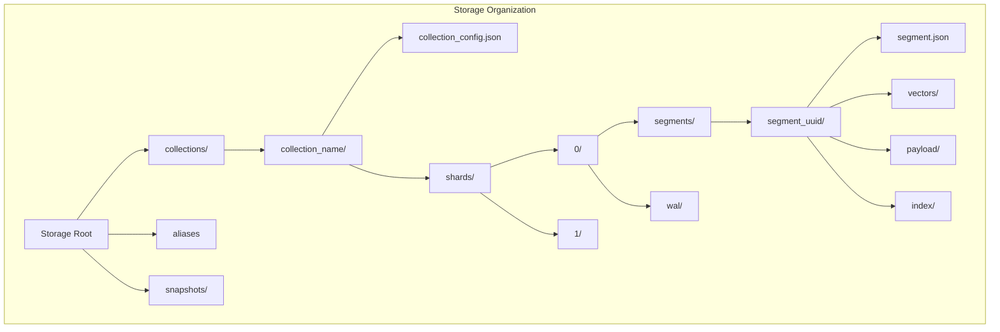

Qdrant's storage engine is designed for high performance, reliability, and efficient resource utilization. This document explores the storage layer architecture, persistence strategies, and data organization.

## Storage Hierarchy



## Core Storage Components

### TableOfContent (ToC)

The TableOfContent (`lib/storage/src/content_manager/toc/mod.rs`) is the central storage orchestrator.

**Responsibilities:**

- **Collection Lifecycle**: Creating, loading, and deleting collections
- **Alias Management**: Mapping collection aliases to actual collection names
- **Resource Allocation**: Managing CPU budgets for optimization tasks
- **Consensus Integration**: Coordinating with Raft in distributed mode

**Storage Path Layout:**

```
{storage_path}/
├── collections/
│   ├── my_collection/
│   │   ├── collection_config.json
│   │   └── shards/
│   └── another_collection/
├── aliases
├── snapshots/
└── .deleted/  # Temporary directory for safe deletion
```

**Collection Loading:**

Collections are loaded concurrently on startup with configurable concurrency (`load_concurrency`):

```rust
// lib/storage/src/content_manager/toc/mod.rs:186
let mut collection_stream = stream::iter(collection_load_tasks)
    .buffer_unordered(
        storage_config
            .performance
            .load_concurrency
            .get_concurrent_collections()
            .get(),
    );
```

### Segment Storage

Segments are the fundamental storage units containing vectors, payloads, and indexes.

**Segment Structure** (`lib/segment/src/segment/mod.rs:66`):

```rust
pub struct Segment {
    pub uuid: Uuid,
    pub version: Option<SeqNumberType>,           // Latest update sequence
    pub persisted_version: Arc<Mutex<Option<SeqNumberType>>>,
    pub id_tracker: Arc<AtomicRefCell<IdTrackerSS>>,
    pub vector_data: HashMap<VectorNameBuf, VectorData>,
    pub payload_index: Arc<AtomicRefCell<StructPayloadIndex>>,
    pub payload_storage: Arc<AtomicRefCell<PayloadStorageEnum>>,
    pub segment_type: SegmentType,
    // ...
}
```

**Segment Types:**

- **Plain**: In-memory storage, fast but limited by RAM
- **Indexed**: HNSW index with in-memory or on-disk vectors
- **Special**: Optimized segments for specific use cases

### Vector Storage

Vectors can be stored in multiple formats optimized for different scenarios.

**Storage Implementations** (`lib/segment/src/vector_storage/`):

| Type | Description | Use Case |
|------|-------------|----------|
| `SimpleDenseVectorStorage` | In-memory, fast access | Small collections, high throughput |
| `MemmapDenseVectorStorage` | Memory-mapped files | Large collections, limited RAM |
| `AppendableDenseVectorStorage` | Appendable with mmap | Growing collections |
| `QuantizedVectorStorage` | Compressed vectors | Memory optimization, GPU acceleration |
| `MultiDenseVectorStorage` | Multiple vectors per point | Multi-vector scenarios |
| `SparseSparseVectorStorage` | Sparse vector format | Text embeddings, high-dimensional sparse data |

**Vector Data Layout:**

```rust
pub struct VectorData {
    pub vector_index: Arc<AtomicRefCell<VectorIndexEnum>>,
    pub vector_storage: Arc<AtomicRefCell<VectorStorageEnum>>,
    pub quantized_vectors: Arc<AtomicRefCell<Option<QuantizedVectors>>>,
}
```

### Payload Storage

Payload data is stored separately from vectors with multiple backend options.

**Storage Backends** (`lib/segment/src/payload_storage/`):

1. **On-Disk Storage** (RocksDB): Default for production
   - Persistent key-value store
   - Automatic compression
   - Efficient range queries

2. **Mmap Storage**: Memory-mapped payload files
   - Lower memory footprint
   - OS-managed caching

3. **In-Memory Storage**: For testing and small datasets

### ID Tracking

The ID tracker maps external point IDs to internal offsets and manages point versions.

**Capabilities:**

- **Bidirectional Mapping**: External ID ↔ Internal Offset
- **Version Tracking**: Point-level version numbers for consistency
- **Deleted Points**: Efficient deletion without immediate data removal
- **Persistence**: Stored in separate files for durability

## Persistence Mechanisms

### Write-Ahead Log (WAL)

Every local shard maintains a WAL for durability and recovery.

**WAL Operations** (`lib/collection/src/shards/local_shard/wal_ops.rs`):

```rust
// Operations are first written to WAL
wal.write(&operation)?;

// Then applied to segments
self.apply_operation(operation)?;

// WAL entries are acknowledged
wal.ack(sequence_number)?;
```

**WAL Benefits:**

- **Crash Recovery**: Replay operations after unexpected shutdown
- **Asynchronous Flushing**: Decouple writes from disk sync
- **Transfer Support**: Replay operations during shard transfer

### Flushing Strategy

Qdrant uses periodic flushing to persist in-memory state.

**Flush Workers** (`lib/collection/src/update_workers/flush_workers.rs`):

- **Segment Flush**: Persist segment data (vectors, payloads, indexes)
- **WAL Flush**: Sync WAL to disk
- **Config Flush**: Save collection and shard configuration

**Flush Triggers:**

1. **Time-based**: Regular interval (configurable)
2. **Operation count**: After N operations
3. **Memory pressure**: When approaching memory limits
4. **Explicit**: User-requested flush

### Versioning and Consistency

**Sequence Numbers:**

Every operation is assigned a monotonically increasing sequence number:

```rust
pub type SeqNumberType = u64;

pub struct Segment {
    pub version: Option<SeqNumberType>,  // Latest applied operation
    pub persisted_version: Arc<Mutex<Option<SeqNumberType>>>,
    // ...
}
```

**Consistency Guarantees:**

- **Point-level Versioning**: Each point has a version number
- **Segment Versioning**: Tracks highest applied sequence
- **Idempotent Operations**: Same operation can be applied multiple times safely

## Optimization and Compaction

### Segment Optimization

**Optimization Workers** (`lib/collection/src/update_workers/optimization_worker.rs`):

Background tasks continuously optimize segment structure:

1. **Indexing**: Build HNSW indexes on plain segments
2. **Merging**: Combine small segments into larger ones
3. **Vacuum**: Remove deleted points and reclaim space
4. **Reindexing**: Rebuild indexes after configuration changes

**Optimizer Configuration:**

```json
{
  "indexing_threshold": 20000,
  "max_segment_size": 100000,
  "memmap_threshold": 50000,
  "max_optimization_threads": 4
}
```

### Resource Management

**CPU Budget** (`lib/storage/src/content_manager/toc/mod.rs:75`):

```rust
pub struct TableOfContent {
    optimizer_resource_budget: ResourceBudget,
    // ...
}
```

Optimization tasks request CPU permits from the global budget to prevent overwhelming the system.

## Memory Management

### Memory-Mapped Files

Qdrant extensively uses memory-mapped files (mmap) for efficient memory usage:

**Advantages:**

- **Lazy Loading**: Only accessed pages are loaded into RAM
- **OS-Managed Cache**: Kernel handles caching decisions
- **Large Dataset Support**: Work with datasets larger than RAM
- **Shared Memory**: Multiple processes can access same data

**Implementation:**

- Vector storage: `MemmapDenseVectorStorage`
- HNSW graph: `GraphLinks` with mmap support
- Chunked vectors: `ChunkedMmapVectors` for efficient access patterns

### Quantization

Vector quantization reduces memory footprint and increases throughput:

**Quantization Types:**

1. **Scalar Quantization**: Reduce float32 to int8/uint8
2. **Product Quantization**: Compress vectors using codebooks
3. **Binary Quantization**: 1-bit per dimension for compatible distances

**Memory Savings:**

- Scalar: 4x reduction (float32 → uint8)
- Product: 8-32x reduction (configurable)
- Binary: 32x reduction

## Data Safety

### Safe Deletion

Qdrant uses a two-phase deletion process:

```rust
// lib/storage/src/content_manager/toc/mod.rs:692
let deleted_dir = self.storage_config.storage_path.join(".deleted");
tokio::task::spawn_blocking(move || {
    safe_delete_in_tmp(&path, &deleted_dir)?.close()
})
```

1. **Move to `.deleted/`**: Data is moved, not immediately removed
2. **Background Cleanup**: Actual deletion happens asynchronously
3. **Crash Safety**: Incomplete deletions are cleaned up on restart

### Snapshots

Qdrant supports point-in-time snapshots for backup and recovery:

**Snapshot Types:**

- **Collection Snapshot**: Full collection backup
- **Shard Snapshot**: Individual shard backup
- **Continuous Snapshot**: Stream-based backup for large collections

**Snapshot Process:**

1. Create temporary snapshot directory
2. Copy segment files and configuration
3. Package into tar archive
4. Store locally or upload to remote storage

## Configuration

### Storage Configuration

```yaml
storage:
  storage_path: "./storage"
  snapshots_path: "./snapshots"
  temp_path: "./temp"
  on_disk_payload: true
  
performance:
  max_optimization_threads: 4
  load_concurrency: 4
```

### Per-Collection Settings

```json
{
  "optimizer_config": {
    "indexing_threshold": 20000,
    "memmap_threshold": 50000
  },
  "hnsw_config": {
    "on_disk": false
  },
  "quantization_config": {
    "scalar": {
      "type": "int8",
      "quantile": 0.99
    }
  }
}
```

## Performance Considerations

### Read Performance

- **Mmap Usage**: Reduces memory pressure, relies on OS page cache
- **Prefetching**: Read-ahead for sequential access patterns
- **Index Locality**: HNSW graph optimized for cache efficiency

### Write Performance

- **Batch Updates**: Group multiple operations for efficiency
- **Async WAL**: Non-blocking writes with background sync
- **Delayed Indexing**: Build indexes in background after threshold

### Storage Efficiency

- **Compression**: Quantization for vectors, compression for payloads
- **Deduplication**: Shared storage for identical vectors
- **Sparse Formats**: Efficient storage for sparse vectors

## Next Steps

<CardGroup cols={2}>
  <Card title="Vector Indexing" icon="vector-square" href="/advanced/vector-indexing">
    Learn about HNSW implementation and index structures
  </Card>
  <Card title="Distributed Deployment" icon="server" href="/advanced/distributed-deployment">
    Understand distributed storage and consensus
  </Card>
  <Card title="Performance Tuning" icon="gauge-high" href="/operations/performance-tuning">
    Optimize storage configuration for your use case
  </Card>
  <Card title="Snapshots" icon="camera" href="/guides/snapshots">
    Learn about backup and recovery strategies
  </Card>
</CardGroup>