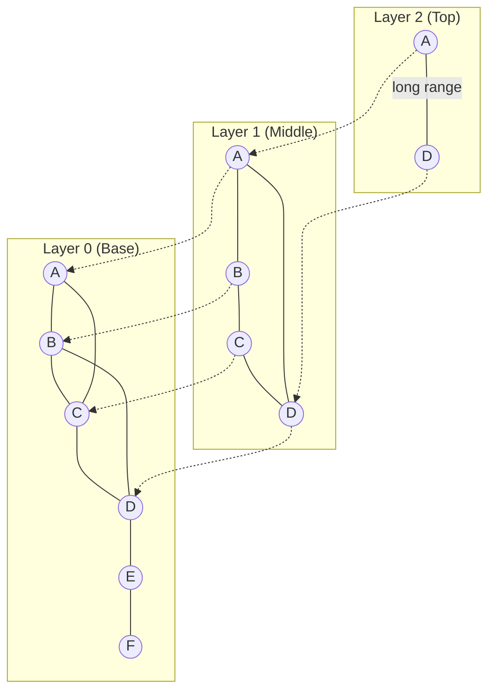

Qdrant uses Hierarchical Navigable Small World (HNSW) graphs as the primary indexing structure for approximate nearest neighbor (ANN) search. This document explores the implementation, optimization, and usage of vector indexes.

## HNSW Overview

HNSW is a graph-based algorithm that provides fast approximate nearest neighbor search with high recall.

### Key Concepts

**Hierarchical Layers:**



- **Layer 0**: Contains all points with dense connections
- **Higher Layers**: Sparse subgraphs for fast traversal
- **Navigation**: Start from top layer, zoom in to layer 0

## HNSWIndex Implementation

### Core Structure

**HNSWIndex** (`lib/segment/src/index/hnsw_index/hnsw.rs:89`):

```rust
pub struct HNSWIndex {
    id_tracker: Arc<AtomicRefCell<IdTrackerSS>>,
    vector_storage: Arc<AtomicRefCell<VectorStorageEnum>>,
    quantized_vectors: Arc<AtomicRefCell<Option<QuantizedVectors>>>,
    payload_index: Arc<AtomicRefCell<StructPayloadIndex>>,
    config: HnswGraphConfig,
    path: PathBuf,
    graph: GraphLayers,
    is_on_disk: bool,
}
```

### Graph Layers

**GraphLayers** (`lib/segment/src/index/hnsw_index/graph_layers.rs:73`):

```rust
pub struct GraphLayers {
    pub(super) hnsw_m: HnswM,              // M and M0 parameters
    pub(super) links: GraphLinks,          // Edge storage
    pub(super) entry_points: EntryPoints,  // Top-layer entry points
    pub(super) visited_pool: VisitedPool,  // Reusable visited lists
}
```

**HnswM Parameters** (`lib/segment/src/index/hnsw_index/mod.rs:21`):

```rust
pub struct HnswM {
    pub m: usize,   // Max connections for layers > 0
    pub m0: usize,  // Max connections for layer 0 (typically 2*m)
}
```

### Configuration

**HnswConfig Parameters:**

```json
{
  "m": 16,
  "ef_construct": 100,
  "full_scan_threshold": 10000,
  "max_indexing_threads": 0,
  "on_disk": false,
  "payload_m": 0
}
```

| Parameter | Description | Default | Impact |
|-----------|-------------|---------|--------|
| `m` | Max bi-directional links per element | 16 | Higher = better recall, more memory |
| `ef_construct` | Size of dynamic candidate list during construction | 100 | Higher = better quality, slower build |
| `full_scan_threshold` | Switch to brute-force below this size (KB) | 10000 | Threshold for index usage |
| `max_indexing_threads` | Threads for index building | 0 (auto) | Parallel construction |
| `on_disk` | Store graph on disk via mmap | false | Memory vs disk trade-off |
| `payload_m` | Additional edges based on payload | 0 | Improves filtered search |

## Index Construction

### Build Process

**GraphLayersBuilder** (`lib/segment/src/index/hnsw_index/graph_layers_builder.rs`):

```rust
// Single-threaded initial build to ensure connectivity
for point_id in 0..SINGLE_THREADED_HNSW_BUILD_THRESHOLD {
    graph_layers_builder.insert(point_id)?;
}

// Parallel build for remaining points
remaining_points.par_iter().for_each(|&point_id| {
    graph_layers_builder.insert(point_id);
});
```

**Build Stages:**

1. **Single-threaded Bootstrap** (first 256 points)
   - Ensures connected graph structure
   - Prevents disconnected components

2. **Parallel Construction** (remaining points)
   - Multi-threaded insertion
   - Uses rayon thread pool
   - CPU budget management

3. **Graph Optimization** (post-build)
   - Link pruning
   - Connectivity repair
   - Quality improvement

### Insert Algorithm

**Point Insertion** (`lib/segment/src/index/hnsw_index/hnsw.rs`):

```rust
// 1. Determine insertion level (probabilistic)
let level = select_random_level(ml);

// 2. Find entry point at top layer
let mut entry_point = get_entry_point();

// 3. Search for nearest neighbors layer by layer
for layer in (level+1..max_layer).rev() {
    entry_point = search_entry_on_level(entry_point, layer);
}

// 4. Insert into appropriate layers
for layer in (0..=level).rev() {
    let candidates = search_on_level(entry_point, layer, ef_construct);
    let neighbors = select_neighbors_heuristic(candidates, m);
    
    // 5. Add bidirectional links
    add_links(point_id, neighbors, layer);
    
    // 6. Prune neighbors' connections if needed
    for neighbor in neighbors {
        prune_connections(neighbor, layer, m);
    }
}
```

**Layer Selection:**

```rust
// Exponentially decaying probability
let ml = 1.0 / (m as f64).ln();
let level = (-random_uniform() * ml).floor() as usize;
```

Most points are on layer 0, few reach higher layers.

## Search Algorithms

### Standard HNSW Search

**Search Process** (`lib/segment/src/index/hnsw_index/graph_layers.rs:108`):

```rust
fn search_on_level(
    &self,
    level_entry: ScoredPointOffset,
    level: usize,
    ef: usize,
    points_scorer: &mut FilteredScorer,
) -> FixedLengthPriorityQueue<ScoredPointOffset> {
    let mut visited_list = self.get_visited_list_from_pool();
    let mut search_context = SearchContext::new(ef);
    
    // Greedy beam search
    while let Some(candidate) = search_context.candidates.pop() {
        if candidate.score < search_context.lower_bound() {
            break;  // All remaining candidates are worse
        }
        
        // Explore neighbors
        self.for_each_link(candidate.idx, level, |link| {
            if !visited_list.check(link) {
                let score = points_scorer.score_point(link);
                search_context.process_candidate(ScoredPointOffset {
                    idx: link,
                    score,
                });
                visited_list.update(link);
            }
        });
    }
    
    search_context.nearest
}
```

**Key Components:**

- **Visited List**: Prevents re-exploring same points
- **Candidate Queue**: Min-heap of points to explore
- **Nearest Queue**: Max-heap of current best results
- **Lower Bound**: Worst score in nearest queue

### ACORN Algorithm

**ACORN-1** (`lib/segment/src/index/hnsw_index/graph_layers.rs:154`):

Advanced variant that explores 2-hop neighbors for better recall with deletions:

```rust
fn search_on_level_acorn(
    &self,
    level_entry: ScoredPointOffset,
    level: usize,
    ef: usize,
    points_scorer: &mut FilteredScorer,
) -> FixedLengthPriorityQueue<ScoredPointOffset> {
    // Track 1-hop and 2-hop visited separately
    let mut hop1_visited_list = self.get_visited_list_from_pool();
    let mut hop2_visited_list = self.get_visited_list_from_pool();
    
    while let Some(candidate) = search_context.candidates.pop() {
        // Explore 1-hop neighbors
        self.try_for_each_link(candidate.idx, level, |hop1| {
            if hop1_visited_list.check_and_update_visited(hop1) {
                return;
            }
            
            if !is_deleted(hop1) {
                score_and_add(hop1);
            } else {
                // Explore 2-hop neighbors of deleted points
                self.for_each_link(hop1, level, |hop2| {
                    if !hop2_visited_list.check(hop2) {
                        score_and_add(hop2);
                    }
                });
            }
        });
    }
}
```

ACORN improves recall when many points are deleted by exploring neighbors of deleted points.

### Filtered Search

**FilteredScorer** (`lib/segment/src/index/hnsw_index/point_scorer.rs`):

Combines vector similarity with payload filtering:

```rust
pub struct FilteredScorer<'a> {
    raw_scorer: Box<dyn RawScorer + 'a>,
    filter: Option<Filter>,
    id_tracker: &'a IdTrackerSS,
    payload_index: &'a StructPayloadIndex,
}

impl FilteredScorer<'_> {
    fn score_point(&mut self, point_id: PointOffsetType) -> f32 {
        // Check if point matches filter
        if let Some(filter) = &self.filter {
            if !self.check_filter(point_id) {
                return f32::MIN;  // Exclude from results
            }
        }
        
        // Calculate vector similarity
        self.raw_scorer.score_point(point_id)
    }
}
```

**Optimization Strategies:**

1. **Small Cardinality**: Switch to exact search if filter matches few points
2. **Large Cardinality**: Use HNSW with on-the-fly filtering
3. **Payload Index**: Pre-filter using payload indexes when available

## Graph Storage

### Link Storage

**GraphLinks** (`lib/segment/src/index/hnsw_index/graph_links/mod.rs`):

Multiple formats for different trade-offs:

1. **Plain Format**: Simple `Vec<Vec<PointOffsetType>>`
   - Fast access
   - Higher memory usage

2. **Compressed Format**: Bit-packed links
   - 30-50% memory reduction
   - Slight CPU overhead

3. **Mmap Format**: Memory-mapped links
   - Minimal RAM usage
   - OS-managed caching
   - Ideal for on-disk indexes

**Link Serialization** (`lib/segment/src/index/hnsw_index/graph_links/serializer.rs`):

```rust
// Links are stored as:
// [point_count][max_level][layer_0_links][layer_1_links]...

// Each layer stores:
// [point_0_link_count][link_1][link_2]...[link_n]
// [point_1_link_count][link_1][link_2]...[link_n]
```

### Entry Points

**EntryPoints** (`lib/segment/src/index/hnsw_index/entry_points.rs`):

Tracks top-level entry points for search initialization:

```rust
pub struct EntryPoints {
    // Entry point per level
    levels: Vec<PointOffsetType>,
}
```

Entry points are selected based on point level during insertion.

## GPU Acceleration

### GPU-Accelerated Build

**GPU Support** (`lib/segment/src/index/hnsw_index/gpu/`):

Qdrant can use GPU for faster index construction:

```rust
#[cfg(feature = "gpu")]
fn build_hnsw_on_gpu(
    gpu_device: &LockedGpuDevice,
    vectors: &GpuVectorStorage,
    config: &HnswGraphConfig,
) -> GraphLayers {
    // 1. Upload vectors to GPU memory
    gpu_device.upload_vectors(vectors);
    
    // 2. Batch compute distances on GPU
    // 3. Build graph structure on CPU with GPU-computed distances
    // 4. Download final graph
}
```

**GPU Benefits:**

- 2-5x faster index construction
- Batch distance computation
- Effective for large datasets (>100k points)

### Quantized GPU Search

**GPU Quantization** (`lib/segment/src/index/hnsw_index/gpu/gpu_vector_storage/gpu_quantization.rs`):

- Store quantized vectors on GPU
- Perform distance calculations on GPU during search
- Fallback to CPU for re-scoring top candidates

## Index Maintenance

### Incremental Updates

HNSW supports online updates without full rebuild:

```rust
// Insert new point
index.add_point(point_id, vector)?;

// Update existing point
index.update_point(point_id, new_vector)?;

// Delete point (soft delete)
index.delete_point(point_id)?;
```

**Delete Strategy:**

- **Soft Delete**: Mark as deleted, keep in graph
- **Lazy Cleanup**: Remove during optimization
- **Link Preservation**: Maintain graph connectivity

### Graph Healing

**GraphLayersHealer** (`lib/segment/src/index/hnsw_index/graph_layers_healer.rs`):

Repairs graph quality after many deletions:

```rust
// Identify disconnected components
let components = find_connected_components(&graph);

// Add cross-component links
for (comp_a, comp_b) in component_pairs {
    let bridge = find_closest_pair(comp_a, comp_b);
    add_bidirectional_link(bridge.0, bridge.1);
}

// Improve link quality
for point in all_points {
    let neighbors = get_neighbors(point);
    let better_neighbors = search_better_neighbors(point);
    update_links(point, better_neighbors);
}
```

## Performance Characteristics

### Time Complexity

| Operation | Complexity | Notes |
|-----------|------------|-------|
| Insert | O(log N · ef_construct · M) | Amortized |
| Search | O(log N · ef_search · M) | Average case |
| Delete | O(1) | Soft delete |
| Build | O(N · log N · ef_construct · M) | Parallel |

### Memory Usage

**Per-Point Overhead:**

```
Memory = vector_size + (avg_links_per_layer * layers * 4 bytes)

Example (768-dim float32, M=16):
- Vector: 768 * 4 = 3,072 bytes
- Links: ~24 * 1.2 * 4 = 115 bytes
- Total: ~3,187 bytes per point
```

### Tuning Guidelines

**For High Recall (>0.99):**

```json
{
  "m": 64,
  "ef_construct": 200,
  "ef": 128
}
```

**For Balanced Performance:**

```json
{
  "m": 16,
  "ef_construct": 100,
  "ef": 64
}
```

**For High Throughput:**

```json
{
  "m": 8,
  "ef_construct": 64,
  "ef": 32,
  "quantization": { "scalar": { "type": "int8" } }
}
```

## Next Steps

<CardGroup cols={2}>
  <Card title="Storage Engine" icon="database" href="/advanced/storage-engine">
    Learn about storage and persistence
  </Card>
  <Card title="Distributed Deployment" icon="server" href="/advanced/distributed-deployment">
    Understand distributed indexing
  </Card>
  <Card title="Quantization" icon="compress" href="/guides/quantization">
    Reduce memory with vector quantization
  </Card>
  <Card title="Filtering" icon="filter" href="/guides/filtering-data">
    Optimize filtered search strategies
  </Card>
</CardGroup>