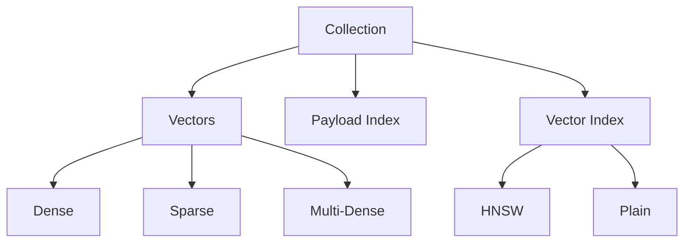

A collection is a named set of points (vectors with payloads) where each point represents a data object. Collections are the primary organizational unit in Qdrant.

## Collection Structure

Collections consist of:

1. **Vectors** - One or more named vector spaces
2. **Payload** - JSON metadata associated with each point
3. **Index** - Structures for fast search (HNSW or plain)
4. **Segments** - Internal storage units



## Collection Configuration

### Basic Configuration

```json
{
  "vectors": {
    "size": 384,
    "distance": "Cosine"
  }
}
```

### Named Vectors

Support multiple vector types per collection:

```json
{
  "vectors": {
    "text-dense": {
      "size": 768,
      "distance": "Cosine"
    },
    "text-sparse": {
      "sparse": true
    },
    "image": {
      "size": 512,
      "distance": "Euclid",
      "datatype": "Float16"
    }
  }
}
```

**Source:** `lib/api/src/rest/schema.rs:78-96`

## Vector Configuration Options

### Dense Vector Config

```rust
pub struct VectorDataConfig {
    pub size: usize,              // Vector dimensionality
    pub distance: Distance,       // Distance metric
    pub storage_type: VectorStorageType,
    pub index: Indexes,           // HNSW or Plain
    pub quantization_config: Option<QuantizationConfig>,
    pub multivector_config: Option<MultiVectorConfig>,
    pub datatype: Option<VectorStorageDatatype>,
}
```

**Source:** `lib/segment/src/types.rs:1580-1597`

<Tabs>
  <Tab title="Size">
    Vector dimensionality (number of elements).

    ```json
    {
      "size": 384  // Must match your embedding model
    }
    ```

    - OpenAI `text-embedding-3-small`: 1536
    - Sentence Transformers `all-MiniLM-L6-v2`: 384
    - CLIP `ViT-B/32`: 512
  </Tab>

  <Tab title="Distance">
    Distance function for vector comparison.

    ```json
    {
      "distance": "Cosine"  // Cosine, Euclid, Dot, Manhattan
    }
    ```

    See [Vectors](/concepts/vectors#distance-metrics) for details.
  </Tab>

  <Tab title="Storage Type">
    Where vectors are stored.

    ```json
    {
      "storage_type": "InRamChunkedMmap"
    }
    ```

    Options: `Memory`, `Mmap`, `ChunkedMmap`, `InRamChunkedMmap`, `InRamMmap`
  </Tab>

  <Tab title="Datatype">
    Vector element precision.

    ```json
    {
      "datatype": "Float16"  // Float32 (default), Float16, Uint8
    }
    ```

    Float16 reduces memory by 50%, Uint8 by 75%.
  </Tab>
</Tabs>

## Sparse Vector Configuration

```rust
pub struct SparseVectorDataConfig {
    pub index: SparseIndexConfig,
    pub storage_type: SparseVectorStorageType,
    pub modifier: Option<Modifier>,
}
```

**Source:** `lib/segment/src/types.rs:1685-1697`

```json
{
  "vectors": {
    "sparse-text": {
      "sparse": true,
      "index": {
        "full_scan_threshold": 5000
      },
      "modifier": "idf"  // Optional: IDF weighting
    }
  }
}
```

## Multi-Vector Configuration

For late interaction models like ColBERT:

```rust
pub struct MultiVectorConfig {
    pub comparator: MultiVectorComparator,  // MaxSim (default)
}
```

**Source:** `lib/segment/src/types.rs:1542-1545`

```json
{
  "vectors": {
    "size": 128,
    "distance": "Cosine",
    "multivector_config": {
      "comparator": "MaxSim"
    }
  }
}
```

## Index Configuration

Collections can use two index types:

<Tabs>
  <Tab title="HNSW Index">
    Approximate nearest neighbor search with high recall.

    ```json
    {
      "index": {
        "type": "hnsw",
        "options": {
          "m": 16,
          "ef_construct": 100,
          "full_scan_threshold": 10000
        }
      }
    }
    ```

    **Parameters:**
    - `m`: Edges per node (16 default, higher = better quality + more memory)
    - `ef_construct`: Neighbors during build (100 default, higher = better quality + slower build)
    - `full_scan_threshold`: Use brute force below this point count

    **Source:** `lib/segment/src/types.rs:652-684`
  </Tab>

  <Tab title="Plain Index">
    Brute force search, 100% recall, no index overhead.

    ```json
    {
      "index": {
        "type": "plain"
      }
    }
    ```

    **Use cases:**
    - Small collections (< 10K points)
    - Maximum precision required
    - Temporary collections
  </Tab>
</Tabs>

## Quantization

Reduce memory and improve search speed:

<Tabs>
  <Tab title="Scalar Quantization">
    Convert Float32 → Int8 (4x compression).

    ```json
    {
      "quantization_config": {
        "scalar": {
          "type": "int8",
          "quantile": 0.99,
          "always_ram": true
        }
      }
    }
    ```

    **Source:** `lib/segment/src/types.rs:759-770`
  </Tab>

  <Tab title="Product Quantization">
    Advanced compression with subvectors.

    ```json
    {
      "quantization_config": {
        "product": {
          "compression": "x16",
          "always_ram": false
        }
      }
    }
    ```

    Compression ratios: x4, x8, x16, x32, x64

    **Source:** `lib/segment/src/types.rs:791-796`
  </Tab>

  <Tab title="Binary Quantization">
    Extreme compression for Cosine/Dot metrics.

    ```json
    {
      "quantization_config": {
        "binary": {
          "encoding": "one_bit",
          "always_ram": true
        }
      }
    }
    ```

    Encodings: `one_bit` (32x), `two_bits` (16x), `one_and_half_bits` (21x)

    **Source:** `lib/segment/src/types.rs:841-853`
  </Tab>
</Tabs>

## Segment Configuration

```rust
pub struct SegmentConfig {
    pub vector_data: HashMap<String, VectorDataConfig>,
    pub sparse_vector_data: HashMap<String, SparseVectorDataConfig>,
    pub payload_storage_type: PayloadStorageType,
}
```

**Source:** `lib/segment/src/types.rs:1370`

Collections are divided into segments for efficient storage:

- **Plain segments:** Appendable, no index, fast writes
- **Indexed segments:** Optimized for search, immutable
- **Special segments:** System-managed

## Collection Defaults

```rust
pub struct CollectionConfigDefaults {
    // Default settings applied to all vectors
}
```

**Source:** `lib/segment/src/data_types/collection_defaults.rs:8`

```json
{
  "vectors": {
    "on_disk": false  // Default for all vectors
  }
}
```

## Strict Mode Configuration

Enforce limits on collection operations:

```rust
pub struct StrictModeConfig {
    pub enabled: Option<bool>,
    pub max_query_limit: Option<usize>,
    pub max_timeout: Option<usize>,
    pub search_max_hnsw_ef: Option<usize>,
    pub search_allow_exact: Option<bool>,
    // ... more limits
}
```

**Source:** `lib/segment/src/types.rs:1029-1100`

```json
{
  "strict_mode": {
    "enabled": true,
    "max_query_limit": 1000,
    "search_max_hnsw_ef": 512,
    "max_collection_vector_size_bytes": 10737418240
  }
}
```

## Example Configurations

<CodeGroup>
  ```json Text Search Collection
  {
    "vectors": {
      "size": 768,
      "distance": "Cosine",
      "storage_type": "InRamChunkedMmap"
    },
    "hnsw_config": {
      "m": 16,
      "ef_construct": 100
    },
    "quantization_config": {
      "scalar": {
        "type": "int8",
        "always_ram": true
      }
    }
  }
  ```

  ```json Image Search Collection
  {
    "vectors": {
      "size": 512,
      "distance": "Euclid",
      "datatype": "Float16",
      "storage_type": "ChunkedMmap"
    },
    "hnsw_config": {
      "m": 32,
      "ef_construct": 200,
      "on_disk": true
    }
  }
  ```

  ```json Hybrid Search Collection
  {
    "vectors": {
      "dense": {
        "size": 384,
        "distance": "Cosine"
      },
      "sparse": {
        "sparse": true,
        "modifier": "idf"
      }
    }
  }
  ```

  ```json ColBERT Collection
  {
    "vectors": {
      "size": 128,
      "distance": "Cosine",
      "multivector_config": {
        "comparator": "MaxSim"
      }
    },
    "strict_mode": {
      "enabled": true,
      "max_vectors": 128
    }
  }
  ```
</CodeGroup>

## Best Practices

<AccordionGroup>
  <Accordion title="Vector Configuration">
    - Match `size` exactly to your embedding model
    - Use `Cosine` for normalized embeddings (most common)
    - Consider `Float16` datatype for 50% memory savings
    - Enable quantization for large collections (>100K vectors)
  </Accordion>

  <Accordion title="Index Settings">
    - Default HNSW `m=16` works well for most cases
    - Increase `m` to 32-64 for better recall on large collections
    - Set `full_scan_threshold` based on filtered search patterns
    - Use `on_disk: true` for HNSW when memory is limited
  </Accordion>

  <Accordion title="Storage Strategy">
    - `InRamChunkedMmap`: Best default for most workloads
    - `ChunkedMmap`: Cost-effective for large collections
    - `Memory`: Legacy, prefer InRamChunkedMmap
  </Accordion>

  <Accordion title="Named Vectors">
    - Use for multi-modal search (text + image)
    - Combine dense + sparse for hybrid search
    - Each vector can have independent configuration
  </Accordion>
</AccordionGroup>

## Related Concepts

<CardGroup cols={2}>
  <Card title="Vectors" href="/concepts/vectors">
    Deep dive into vector types and metrics
  </Card>
  <Card title="Points" href="/concepts/points">
    Learn about points structure
  </Card>
  <Card title="Indexing" href="/concepts/indexing">
    Understanding HNSW and other indexes
  </Card>
  <Card title="Filtering" href="/concepts/filtering">
    Payload filtering capabilities
  </Card>
</CardGroup>
