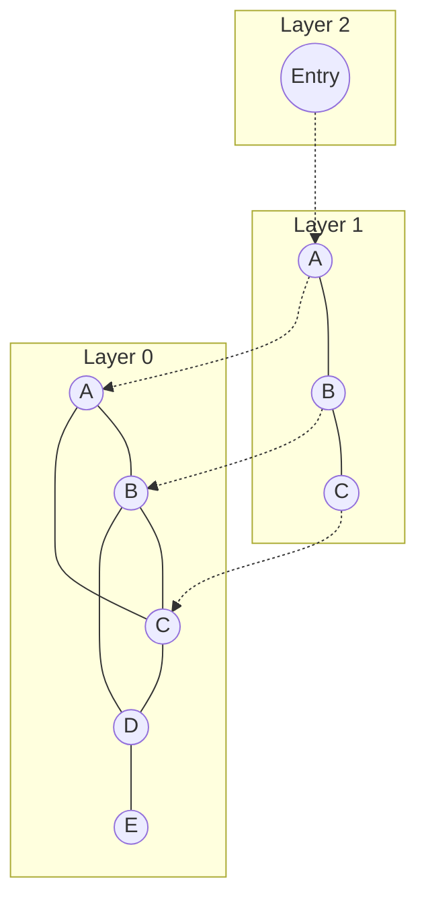
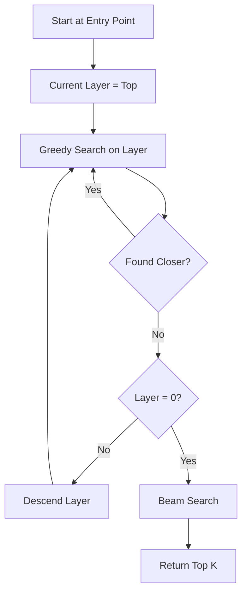

Qdrant uses specialized indexes to enable fast vector search and payload filtering. Understanding indexing is key to optimizing performance.

## Index Types

```rust
pub enum Indexes {
    Plain {},           // No index, brute-force search
    Hnsw(HnswConfig),  // Hierarchical Navigable Small World
}
```

**Source:** `lib/segment/src/types.rs:621-628`

<CardGroup cols={2}>
  <Card title="HNSW Index" icon="diagram-project">
    Approximate nearest neighbor search with high recall and speed.
  </Card>
  <Card title="Plain Index" icon="list">
    Exact search through all vectors, 100% recall.
  </Card>
</CardGroup>

## HNSW Index

Hierarchical Navigable Small World (HNSW) is a graph-based index for approximate nearest neighbor search.

### HNSW Structure



**Key Concepts:**
- **Hierarchical layers:** Upper layers for long-distance navigation, layer 0 for fine-grained search
- **Small world property:** Short paths between any two nodes
- **Navigable:** Greedy search finds good approximations quickly

### HNSW Configuration

```rust
pub struct HnswConfig {
    pub m: usize,                     // Edges per node
    pub ef_construct: usize,          // Build-time beam size
    pub full_scan_threshold: usize,   // Brute-force below this
    pub max_indexing_threads: usize,  // Parallel build threads
    pub on_disk: Option<bool>,        // Store on disk
    pub payload_m: Option<usize>,     // M for payload indexes
    pub inline_storage: Option<bool>, // Inline vectors in index
}
```

**Source:** `lib/segment/src/types.rs:652-684`

<Tabs>
  <Tab title="m Parameter">
    Number of bidirectional edges per node (except layer 0, which uses `m0 = m * 2`).

    ```json
    {
      "hnsw_config": {
        "m": 16
      }
    }
    ```

    **Impact:**
    - **Higher m:** Better recall, more memory, slightly slower search
    - **Lower m:** Less memory, potentially lower recall
    - **Default:** 16 (good for most cases)
    - **Recommendations:**
      - General purpose: 16
      - High precision: 32-64
      - Memory constrained: 8-12

    **Memory:** ~`m * 2 * 4 bytes * num_points` for graph structure
  </Tab>

  <Tab title="ef_construct">
    Beam size during index construction (number of neighbors explored).

    ```json
    {
      "hnsw_config": {
        "ef_construct": 100
      }
    }
    ```

    **Impact:**
    - **Higher ef_construct:** Better graph quality, slower build
    - **Lower ef_construct:** Faster build, potentially worse recall
    - **Default:** 100
    - **Recommendations:**
      - Fast build: 64-100
      - Balanced: 100-200
      - Maximum quality: 200-400

    **Source:** `lib/segment/src/index/hnsw_index/config.rs:16`
  </Tab>

  <Tab title="full_scan_threshold">
    Point count below which brute-force search is used instead of HNSW.

    ```json
    {
      "hnsw_config": {
        "full_scan_threshold": 10000
      }
    }
    ```

    **Note:** Measured in KB of vector data, not point count.
    - 1 KB ≈ 1 vector of size 256 (Float32)
    - Default: 10,000 KB

    **Source:** `lib/segment/src/types.rs:658-665`
  </Tab>

  <Tab title="on_disk">
    Store HNSW graph on disk instead of RAM.

    ```json
    {
      "hnsw_config": {
        "on_disk": true
      }
    }
    ```

    **Trade-offs:**
    - ✅ Reduced RAM usage
    - ⚠️ Slower search (disk I/O)
    - Use when: Memory limited, large collections

    **Source:** `lib/segment/src/types.rs:673-674`
  </Tab>
</Tabs>

### HNSW Internal Structure

```rust
pub struct HnswGraphConfig {
    pub m: usize,
    pub m0: usize,              // m * 2 for layer 0
    pub ef_construct: usize,
    pub ef: usize,              // Search-time beam (default: ef_construct)
    pub full_scan_threshold: usize,
    pub max_indexing_threads: usize,
    pub payload_m: Option<usize>,
    pub indexed_vector_count: Option<usize>,
}
```

**Source:** `lib/segment/src/index/hnsw_index/config.rs:11-32`

## HNSW Building Process

<Steps>
  <Step title="Initialize Graph">
    Create empty multi-layer graph structure.

    **Source:** `lib/segment/src/index/hnsw_index/graph_layers_builder.rs`
  </Step>

  <Step title="Insert Points">
    For each point:
    1. Assign random layer level (exponential distribution)
    2. Find entry point
    3. Greedy search at each layer
    4. Connect to M nearest neighbors
    5. Prune connections to maintain M limit

    **Source:** `lib/segment/src/index/hnsw_index/graph_layers_builder.rs:466`
  </Step>

  <Step title="Parallel Building">
    Use multiple threads for concurrent insertions.

    ```rust
    pub max_indexing_threads: usize,  // 0 = auto (8-16)
    ```

    **Note:** First 256 points built single-threaded to ensure connectivity.

    **Source:** `lib/segment/src/index/hnsw_index/hnsw.rs:82-84`
  </Step>

  <Step title="Optimization">
    Optional post-build healing to fix disconnected components.

    **Source:** `lib/segment/src/index/hnsw_index/graph_layers_healer.rs`
  </Step>
</Steps>

### Single-Threaded Threshold

```rust
pub const SINGLE_THREADED_HNSW_BUILD_THRESHOLD: usize = 256;
```

**Source:** `lib/segment/src/index/hnsw_index/hnsw.rs:84`

First 256 points built sequentially to prevent disconnected graph components.

## HNSW Search Algorithm



### Search Process

1. **Entry:** Start at top layer entry point
2. **Greedy descent:** Navigate to nearest neighbor per layer
3. **Layer 0 search:** Beam search with `ef` parameter
4. **Result:** Top K nearest neighbors

**Source:** `lib/segment/src/index/hnsw_index/graph_layers.rs`

### Search Parameters

```rust
pub struct SearchParams {
    pub hnsw_ef: Option<usize>,  // Beam size at layer 0
    pub exact: bool,             // Skip HNSW, use brute force
    // ...
}
```

**Source:** `lib/segment/src/types.rs:581-608`

<Accordion title="HNSW EF Parameter">
  Controls search quality at runtime:

  ```json
  {
    "params": {
      "hnsw_ef": 128
    }
  }
  ```

  **Guidelines:**
  - Default: `ef_construct` value
  - Higher ef → better recall, slower search
  - Should be ≥ `limit` (result count)
  - Typical range: 64-512

  **Example impact:**
  - ef=64: ~90% recall, 1ms
  - ef=128: ~95% recall, 2ms
  - ef=256: ~98% recall, 4ms
</Accordion>

## GPU-Accelerated Building

Qdrant supports GPU acceleration for HNSW construction:

```rust
#[cfg(feature = "gpu")]
use super::gpu::gpu_graph_builder::build_hnsw_on_gpu;
```

**Source:** `lib/segment/src/index/hnsw_index/hnsw.rs:47`

**Location:** `lib/segment/src/index/hnsw_index/gpu/`

- Speeds up large index builds (millions of vectors)
- Requires CUDA-compatible GPU
- Transparent fallback to CPU if unavailable

## Payload Indexes

Qdrant maintains separate indexes for payload filtering.

### Payload Index Types

<Tabs>
  <Tab title="Keyword Index">
    Hash-based exact match index.

    ```json
    {
      "field_name": "city",
      "field_schema": "keyword"
    }
    ```

    **Structure:** HashMap with Value keys and BitSet of PointIds
    
    **Use for:** Categories, tags, IDs
  </Tab>

  <Tab title="Numeric Index">
    Range tree for integers and floats.

    ```json
    {
      "field_name": "price",
      "field_schema": "integer"
    }
    ```

    **Source:** `lib/segment/src/index/field_index/numeric_index/`

    Supports:
    - Range queries (gte, lte, gt, lt)
    - Exact match
    - Histogram for cardinality estimation
  </Tab>

  <Tab title="Geo Index">
    Geohash-based spatial index.

    ```json
    {
      "field_name": "location",
      "field_schema": "geo"
    }
    ```

    **Source:** `lib/segment/src/index/field_index/geo_index/`

    Supports:
    - geo_radius
    - geo_bounding_box
    - geo_polygon
  </Tab>

  <Tab title="Text Index">
    Inverted index for full-text search.

    ```json
    {
      "field_name": "description",
      "field_schema": "text"
    }
    ```

    Features:
    - Tokenization
    - Stemming
    - Stop words
    - Optional phrase matching
  </Tab>
</Tabs>

### Payload HNSW Integration

Payload fields can have their own HNSW graphs:

```rust
pub payload_m: Option<usize>,  // M for payload-indexed HNSW
```

**Source:** `lib/segment/src/types.rs:677`

Enables fast filtered search by building HNSW graphs over filtered point subsets.

## Sparse Vector Indexes

```rust
pub struct SparseIndexConfig {
    pub full_scan_threshold: usize,
    pub index_type: SparseIndexType,
}
```

**Source:** `lib/segment/src/index/sparse_index/sparse_index_config.rs:50`

Sparse vectors use inverted indexes:
- **Structure:** Map with dimension IDs as keys and lists of (point_id, value) tuples
- **Optimization:** Only non-zero dimensions indexed
- **Full scan threshold:** Default 5,000 vectors

## Quantization and Indexing

Quantization works alongside HNSW:

<Tabs>
  <Tab title="Scalar Quantization">
    ```json
    {
      "quantization_config": {
        "scalar": {
          "type": "int8",
          "always_ram": true
        }
      }
    }
    ```

    - Quantized vectors stored separately
    - HNSW graph structure unchanged
    - Search uses quantized vectors, rescores with original

    **Source:** `lib/segment/src/vector_storage/quantized/`
  </Tab>

  <Tab title="Binary Quantization">
    ```json
    {
      "quantization_config": {
        "binary": {
          "encoding": "one_bit"
        }
      }
    }
    ```

    Extreme compression (32x) with bitwise operations.
  </Tab>

  <Tab title="Product Quantization">
    ```json
    {
      "quantization_config": {
        "product": {
          "compression": "x16"
        }
      }
    }
    ```

    Advanced subvector quantization.
  </Tab>
</Tabs>

### Inline Storage

```rust
pub inline_storage: Option<bool>,
```

**Source:** `lib/segment/src/types.rs:682-683`

```json
{
  "hnsw_config": {
    "inline_storage": true
  }
}
```

Stores vectors and quantized data within HNSW index file:
- ✅ Faster search (fewer disk seeks)
- ⚠️ Larger index file
- **Requirements:** Quantization enabled, no multi-vectors

## Index Maintenance

### Background Optimization

Qdrant automatically manages segments:

1. **Plain segments:** New points (appendable)
2. **Indexing:** Build HNSW in background
3. **Indexed segments:** Optimized for search

### Rebuilding Triggers

Indexes are rebuilt when configuration changes:

```rust
pub fn mismatch_requires_rebuild(&self, other: &Self) -> bool {
    m != other.m
        || ef_construct != other.ef_construct
        || full_scan_threshold != other.full_scan_threshold
        || on_disk != other.on_disk
        // ...
}
```

**Source:** `lib/segment/src/types.rs:695-715`

<Note>
  Changing `max_indexing_threads` does NOT require rebuild.
</Note>

## Indexing Best Practices

<AccordionGroup>
  <Accordion title="HNSW Configuration">
    - **Default (m=16, ef_construct=100):** Good for most use cases
    - **High precision (m=32, ef_construct=200):** Better recall, 2x memory
    - **Large scale (m=16, ef_construct=100, on_disk=true):** Save RAM
    - **Fast build (m=12, ef_construct=64):** Acceptable for non-critical apps
  </Accordion>

  <Accordion title="Payload Indexes">
    - Index all frequently filtered fields
    - Choose appropriate schema type
    - Enable `range: true` for numeric fields with range queries
    - Use `on_disk: true` for large keyword indexes
    - Consider `enable_hnsw: false` for rarely filtered payload fields
  </Accordion>

  <Accordion title="Memory vs. Disk">
    - **In-memory:** Best latency, limited by RAM
    - **On-disk HNSW:** Saves RAM, slower search (OS caching helps)
    - **Quantization + on-disk:** Maximum compression
    - **Inline storage:** Reduce disk seeks if quantization enabled
  </Accordion>

  <Accordion title="Build Performance">
    - Use default `max_indexing_threads: 0` (auto)
    - Increase `ef_construct` for better quality (if build time acceptable)
    - Enable GPU acceleration for massive datasets (millions of vectors)
    - Monitor build progress and adjust resources
  </Accordion>
</AccordionGroup>

## Monitoring Indexes

### Collection Info

Retrieve index statistics:

```json Response
{
  "result": {
    "indexed_vectors_count": 1000000,
    "points_count": 1000000,
    "segments_count": 5,
    "index_schema": {
      "city": {"data_type": "keyword", "points": 1000000},
      "price": {"data_type": "integer", "points": 950000}
    }
  }
}
```

### Segment Info

```json
{
  "segments": [
    {
      "segment_type": "indexed",
      "num_vectors": 500000,
      "num_indexed_vectors": 500000
    },
    {
      "segment_type": "plain",
      "num_vectors": 10000,
      "num_indexed_vectors": 0
    }
  ]
}
```

**Source:** `lib/segment/src/types.rs:467-484`

## Related Concepts

<CardGroup cols={2}>
  <Card title="Search" href="/concepts/search">
    How HNSW is used during search
  </Card>
  <Card title="Collections" href="/concepts/collections">
    Index configuration in collections
  </Card>
  <Card title="Vectors" href="/concepts/vectors">
    Vector types and storage
  </Card>
  <Card title="Filtering" href="/concepts/filtering">
    Payload index usage in filters
  </Card>
</CardGroup>
