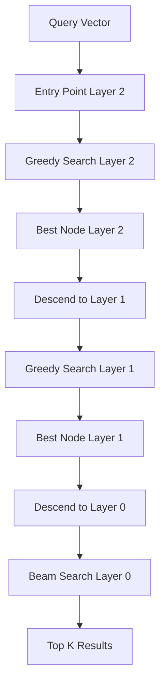

Qdrant provides multiple search strategies optimized for different use cases, from exact nearest neighbor search to filtered approximate search.

## Search Types

Qdrant supports several search paradigms:

<CardGroup cols={2}>
  <Card title="Vector Search" icon="magnifying-glass">
    Find nearest vectors using distance metrics
  </Card>
  <Card title="Filtered Search" icon="filter">
    Combine vector search with payload filters
  </Card>
  <Card title="Hybrid Search" icon="layer-group">
    Combine dense and sparse vectors
  </Card>
  <Card title="Discovery Search" icon="compass">
    Context-aware discovery with positive/negative examples
  </Card>
</CardGroup>

## Search Parameters

```rust
pub struct SearchParams {
    pub hnsw_ef: Option<usize>,      // HNSW search beam size
    pub exact: bool,                  // Force brute-force search
    pub quantization: Option<QuantizationSearchParams>,
    pub indexed_only: bool,           // Search only indexed segments
    pub acorn: Option<AcornSearchParams>,
}
```

**Source:** `lib/segment/src/types.rs:581-608`

<Tabs>
  <Tab title="HNSW EF">
    Controls search quality vs. speed trade-off:

    ```json
    {
      "params": {
        "hnsw_ef": 128  // Higher = better recall, slower
      }
    }
    ```

    - **Default:** Value of `ef_construct` from collection config
    - **Range:** Typically 64-512
    - **Impact:** 2x ef ≈ 2x search time, +5-10% recall
  </Tab>

  <Tab title="Exact Search">
    Disable approximation for 100% recall:

    ```json
    {
      "params": {
        "exact": true  // Brute-force search
      }
    }
    ```

    **Use when:**
    - Maximum precision required
    - Small result sets with filters
    - Debugging/validation
  </Tab>

  <Tab title="Indexed Only">
    Search only optimized segments:

    ```json
    {
      "params": {
        "indexed_only": true
      }
    }
    ```

    Prevents slow searches during indexing, but may miss recent points.
  </Tab>
</Tabs>

## HNSW Search Algorithm

Hierarchical Navigable Small World (HNSW) is the core search algorithm.

### How HNSW Works



**Source:** `lib/segment/src/index/hnsw_index/hnsw.rs:76-300`

### HNSW Configuration

```rust
pub struct HnswGraphConfig {
    pub m: usize,          // Edges per node
    pub m0: usize,         // Edges on layer 0 (m * 2)
    pub ef_construct: usize,  // Build-time beam size
    pub ef: usize,         // Search-time beam size
    pub full_scan_threshold: usize,
    pub max_indexing_threads: usize,
    pub payload_m: Option<usize>,
}
```

**Source:** `lib/segment/src/index/hnsw_index/config.rs:11-32`

<Accordion title="HNSW Parameters Explained">
  - **m (16 default):** Number of bidirectional links per node
    - Higher m = better recall, more memory
    - Recommended: 16 (general), 32 (high precision), 64 (maximum quality)
  
  - **ef_construct (100 default):** Beam size during index building
    - Higher = better graph quality, slower build
    - Recommended: 100-200
  
  - **ef (search time):** Beam size during search
    - Controls recall vs. latency
    - Should be >= desired result count
  
  - **full_scan_threshold:** Point count below which brute force is used
    - Default: 10,000 vectors
    - Measured in KB of vector data
</Accordion>

### HNSW Search Telemetry

```rust
struct HNSWSearchesTelemetry {
    unfiltered_plain: OperationDurationsAggregator,
    filtered_plain: OperationDurationsAggregator,
    unfiltered_hnsw: OperationDurationsAggregator,
    small_cardinality: OperationDurationsAggregator,
    large_cardinality: OperationDurationsAggregator,
    exact_filtered: OperationDurationsAggregator,
    exact_unfiltered: OperationDurationsAggregator,
}
```

**Source:** `lib/segment/src/index/hnsw_index/hnsw.rs:102-110`

Qdrant tracks different search strategies for optimization.

## Search Strategies

### 1. Unfiltered Vector Search

```json
{
  "vector": [0.1, 0.2, 0.3, 0.4],
  "limit": 10
}
```

Direct HNSW traversal, fastest search path.

### 2. Filtered Vector Search

```json
{
  "vector": [0.1, 0.2, 0.3, 0.4],
  "filter": {
    "must": [
      {"key": "city", "match": {"value": "London"}}
    ]
  },
  "limit": 10
}
```

Qdrant automatically selects the best strategy:

<Steps>
  <Step title="Estimate Filter Cardinality">
    Calculate percentage of points matching filter.
  </Step>
  <Step title="Choose Strategy">
    - **Low cardinality (< 5%):** Pre-filter then search
    - **Medium cardinality:** HNSW with filter checks
    - **High cardinality:** Post-filter HNSW results
  </Step>
  <Step title="Execute Search">
    Apply selected strategy with dynamic adjustments.
  </Step>
</Steps>

### 3. ACORN Search

Advanced search for multi-filter queries:

```rust
pub struct AcornSearchParams {
    pub enable: bool,
    pub max_selectivity: Option<OrderedFloat<f64>>,  // Default: 0.4
}
```

**Source:** `lib/segment/src/types.rs:554-574`

```json
{
  "params": {
    "acorn": {
      "enable": true,
      "max_selectivity": 0.4
    }
  }
}
```

ACORN improves recall for complex filters at the cost of performance.

## Quantization Search

```rust
pub struct QuantizationSearchParams {
    pub ignore: bool,           // Skip quantized vectors
    pub rescore: Option<bool>,  // Re-rank with original vectors
    pub oversampling: Option<f64>,  // Fetch extra candidates
}
```

**Source:** `lib/segment/src/types.rs:498-521`

<Tabs>
  <Tab title="Default Behavior">
    ```json
    {
      "params": {
        "quantization": {
          "ignore": false,
          "rescore": true
        }
      }
    }
    ```

    Search quantized vectors, rescore top results with originals.
  </Tab>

  <Tab title="Oversampling">
    ```json
    {
      "params": {
        "quantization": {
          "oversampling": 2.0
        }
      }
    }
    ```

    Fetch 2x candidates from quantized index, then rescore.
    
    - Default: 1.0 (no oversampling)
    - Higher values improve recall
    - Example: limit=100, oversampling=2.0 → fetch 200, return best 100
  </Tab>

  <Tab title="Disable Quantization">
    ```json
    {
      "params": {
        "quantization": {
          "ignore": true
        }
      }
    }
    ```

    Force search with original vectors (slower, exact).
  </Tab>
</Tabs>

## Search Request Examples

<CodeGroup>
  ```json Basic Vector Search
  {
    "vector": [0.1, 0.2, 0.3, 0.4],
    "limit": 10,
    "with_payload": true,
    "with_vector": false
  }
  ```

  ```json Filtered Search
  {
    "vector": [0.1, 0.2, 0.3, 0.4],
    "filter": {
      "must": [
        {"key": "city", "match": {"value": "Berlin"}},
        {"key": "price", "range": {"gte": 100, "lte": 500}}
      ]
    },
    "limit": 20,
    "params": {
      "hnsw_ef": 128
    }
  }
  ```

  ```json High Precision Search
  {
    "vector": [0.1, 0.2, 0.3, 0.4],
    "limit": 10,
    "params": {
      "exact": true,
      "quantization": {
        "ignore": true
      }
    }
  }
  ```

  ```json Named Vector Search
  {
    "vector": {
      "name": "image",
      "vector": [0.1, 0.2, 0.3, 0.4]
    },
    "limit": 10
  }
  ```
</CodeGroup>

## Search Result Scoring

```rust
pub struct ScoredPoint {
    pub id: PointIdType,
    pub version: SeqNumberType,
    pub score: ScoreType,      // Distance/similarity
    pub payload: Option<Payload>,
    pub vector: Option<VectorStructInternal>,
}
```

**Source:** `lib/segment/src/types.rs:373-388`

Scores are post-processed based on distance metric:

```rust
impl Distance {
    pub fn postprocess_score(&self, score: ScoreType) -> ScoreType {
        match self {
            Distance::Cosine => CosineMetric::postprocess(score),
            Distance::Euclid => EuclidMetric::postprocess(score),
            Distance::Dot => DotProductMetric::postprocess(score),
            Distance::Manhattan => ManhattanMetric::postprocess(score),
        }
    }
}
```

**Source:** `lib/segment/src/types.rs:318-325`

<Note>
  **Score Ordering:**
  - **Cosine, Dot:** Higher is better (similarity)
  - **Euclid, Manhattan:** Lower is better (distance)
</Note>

## Search Performance Optimization

### 1. Full Scan Threshold

```rust
pub full_scan_threshold: usize,  // In kilobytes
```

**Source:** `lib/segment/src/types.rs:665`

When estimated result set is small, use brute force:

```json
{
  "hnsw_config": {
    "full_scan_threshold": 10000  // 10,000 KB
  }
}
```

Note: 1KB ≈ 1 vector of size 256 (Float32)

### 2. Payload Index Hints

Qdrant uses payload indexes to optimize filtered search:

- **Indexed fields:** Fast cardinality estimation
- **Unindexed fields:** May trigger full scan

### 3. Batch Search

Search multiple vectors in one request:

```json
{
  "searches": [
    {"vector": [0.1, 0.2], "limit": 10},
    {"vector": [0.3, 0.4], "limit": 10}
  ]
}
```

Shares computation and reduces overhead.

## Advanced Search Features

### Score Threshold

```json
{
  "vector": [0.1, 0.2, 0.3],
  "limit": 100,
  "score_threshold": 0.8  // Only return scores > 0.8
}
```

### Offset and Pagination

```json
{
  "vector": [0.1, 0.2, 0.3],
  "limit": 20,
  "offset": 40  // Skip first 40 results
}
```

<Warning>
  Large offsets are inefficient. Use scroll API for deep pagination.
</Warning>

## GPU-Accelerated Search

Qdrant supports GPU acceleration for HNSW building:

**Source:** `lib/segment/src/index/hnsw_index/gpu/` (feature flag: `gpu`)

- Speeds up index construction
- Transparent fallback to CPU
- Requires CUDA-compatible GPU

## Search Telemetry

Qdrant collects search metrics:

- **Duration aggregators** for each search type
- **Cardinality tracking** for filter optimization
- **Strategy selection** statistics

**Source:** `lib/segment/src/index/hnsw_index/hnsw.rs:112-124`

## Best Practices

<AccordionGroup>
  <Accordion title="HNSW Tuning">
    - Start with defaults (m=16, ef_construct=100)
    - Increase `ef` at search time for better recall
    - Use `exact: true` only when necessary
    - Monitor full_scan_threshold effectiveness
  </Accordion>

  <Accordion title="Filtered Search">
    - Index frequently filtered fields
    - Use `indexed_only: true` during heavy indexing
    - Enable ACORN for complex multi-filter queries
    - Consider filter cardinality in query design
  </Accordion>

  <Accordion title="Quantization">
    - Enable oversampling for better recall (1.5-3.0x)
    - Use rescoring for top-k refinement
    - Benchmark quantization impact on your data
  </Accordion>

  <Accordion title="Performance">
    - Batch similar queries together
    - Use appropriate `hnsw_ef` (don't over-optimize)
    - Monitor search latency per strategy
    - Consider payload size in `with_payload`
  </Accordion>
</AccordionGroup>

## Related Concepts

<CardGroup cols={2}>
  <Card title="Indexing" href="/concepts/indexing">
    HNSW index structure and building
  </Card>
  <Card title="Filtering" href="/concepts/filtering">
    Payload filtering capabilities
  </Card>
  <Card title="Vectors" href="/concepts/vectors">
    Distance metrics and vector types
  </Card>
  <Card title="Collections" href="/concepts/collections">
    Collection configuration for search
  </Card>
</CardGroup>
